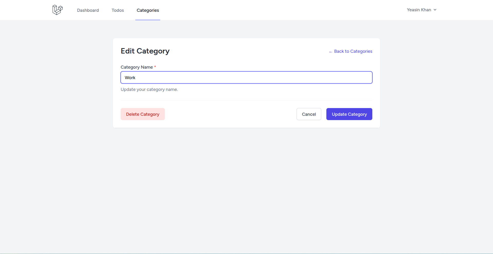

## Todo List With Category

This is a simple todo list application with category support. It uses Laravel 12 and Tailwind CSS for styling.

## Development Installation

To run the application in development mode, run the following commands:
- composer install
- npm install
- php artisan migrate
- php artisan db:seed
- composer run dev

## Screenshots

### Home

### Auth
| Login | Register |
| --- | --- |
 | 

### Dashboard

### Category
| List | Create | Edit |
| --- | --- | --- |
 |  | 

### Todo
| List | Create | Edit |
| --- | --- | --- |
 |  | 

